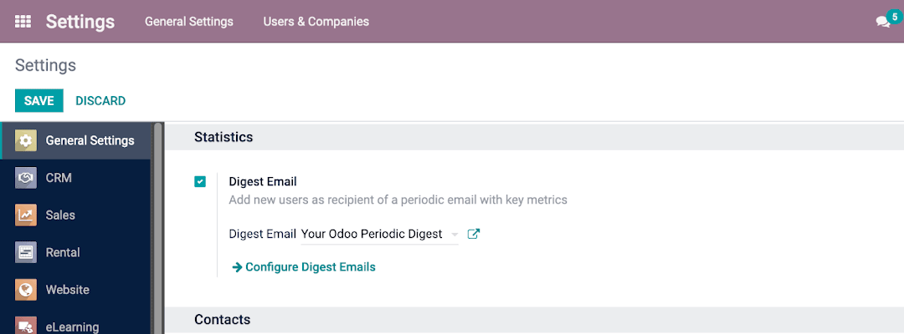

:show-content:

============================
Digest Emails
============================

.. toctree::
   :titlesonly:

   digest_emails/customize_periodic_digest
   digest_emails/create_digest_email

**Digest Emails** are periodic snapshots sent to your organization via email that include high-level information about how your business is performing.

Navigate to Digest Emails by going to :menuselection:`Settings --> General Settings --> Statistics`, then activate the **Digest Emails** feature and click on save.

You can control a variety of settings for your Digest Emails, such as:

- which KPIs are shared in the Digest
- how often Digest Emails are sent
- who in your organization receives Digest Emails
- creating custom Digest Email templates
- adding additional KPIs (Studio required)

.. note::
  By default, Digest Email is *enabled*, and *Your Odoo Periodic Digest* serves as the primary template, which includes all KPI measurements across your Odoo database and is sent daily to administrators.  

.. seealso::
  - :doc:`digest_emails/customize_periodic_digest`
  - :doc:`digest_emails/create_digest_email`
