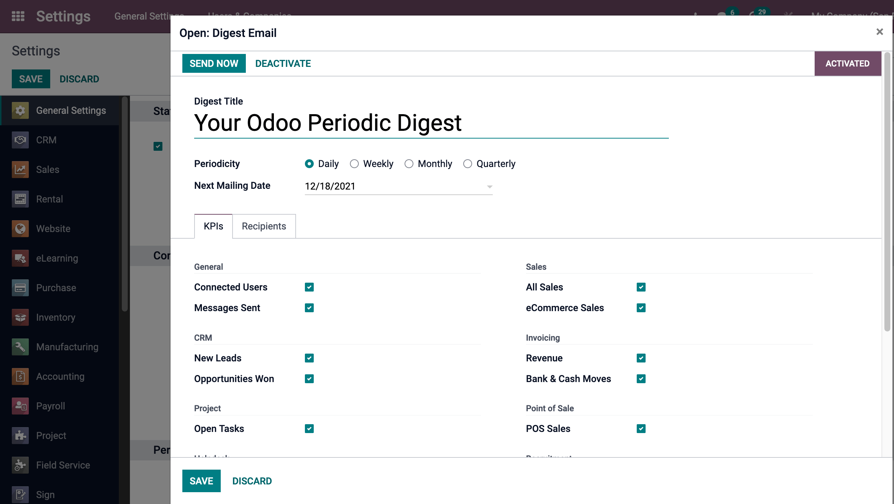

=====================================
Customize *Your Odoo Periodic Digest*
=====================================

To cuzomize the standard *Your Odoo Periodic Digest* email, find the **Digest Email** heading under the **Statistics** section in :menuselection:`Settings --> General Settings`. Then click the **[-->]** icon next to the dropdown selection. 

A popup window will appear and present a edit a variety of settings, which include:

- **Digest Title** - what you would like your Digest Email to be called
- **Periodicity** - control the regimen in how often Digest Emails are sent
- **KPIs** - check/uncheck each calculated KPI that will appear in Digest Emails
- **Recipients** - add/remove users who receive your Digest Emails
- **Custom** - add your own KPIs (Studio required)   

.. seealso::
   - :doc:`create_digest_email`